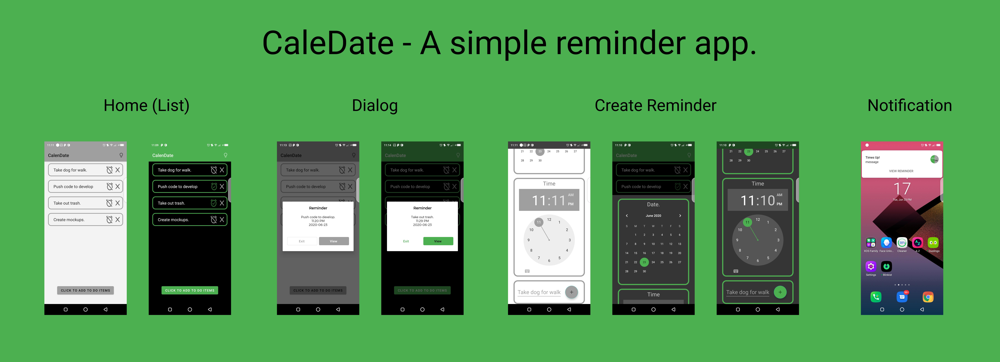

# CalenDate

## About
- A simple Reminder app. Calendate enables users to store, view and delete Reminders from their local database. In addition they can also enable an alarm notification.
- The app has two UI modes. (Night and Day)
- Night mode is called GREEN - PANDA
- Day mode is called GREY - PLACE

## Play
- Take the app for a test drive here. [Calendate App](https://appetize.io/app/p2h3c1trbwcprcznxpf6gf098m)

## Built With 🛠
- [Kotlin](https://kotlinlang.org/) - First class and official programming language for Android development.
- [ViewBinding](https://developer.android.com/topic/libraries/view-binding) - Generates a binding class for each XML layout file present in that module and allows you to more easily write code that interacts with views.
- [Room](https://developer.android.com/topic/libraries/architecture/room?gclid=CjwKCAjwwMn1BRAUEiwAZ_jnEgolz5twQ8VDcXxXd3v6ADuBkkrJ6jvOISrlPYxMTOeUiVo-WOpnuhoCZTAQAvD_BwE&gclsrc=aw.ds) - The Room persistence library provides an abstraction layer over SQLite to allow for more robust database access while harnessing the full power of SQLite.
- [Material design](https://material.io/collections/developer-tutorials/#android-java) - Material is a design system – backed by open-source code – that helps teams build high-quality digital experiences.
- [Android Notification](https://developer.android.com/guide/topics/ui/notifiers/notifications) - A notification is a message that Android displays outside your app's UI to provide the user with reminders, communication from other people, or other timely information from your app. Users can tap the notification to open your app or take an action directly from the notification.
- [Android alarm manager](https://developer.android.com/training/scheduling/alarms) - Alarms (based on the AlarmManager class) give you a way to perform time-based operations outside the lifetime of your application.
- [Android Day / Night mode](https://developer.android.com/guide/topics/ui/look-and-feel/darktheme) - 

## Credit
This project is built with knowledge gained from the android developer Codelabs from Google.
- [The alarm manager](https://codelabs.developers.google.com/codelabs/android-training-alarm-manager/index.html?index=..%2F..android-training#0).
- [Using Android Notifications](https://codelabs.developers.google.com/codelabs/advanced-android-kotlin-training-notifications/#3).
- [Android Room with a View](https://codelabs.developers.google.com/codelabs/android-room-with-a-view/#0).
It uses the MVVM architecture and Room persistance library.

## Contact
If you need any help, you can connect with me.
Visit:- [maku](https://www.linkedin.com/in/maku-mazakpe-700a3a165/)

## License
